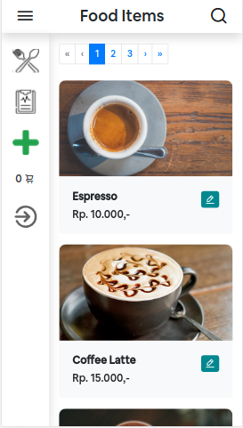
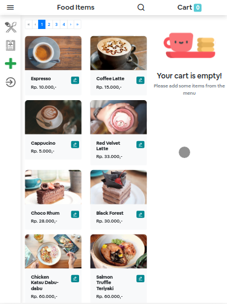
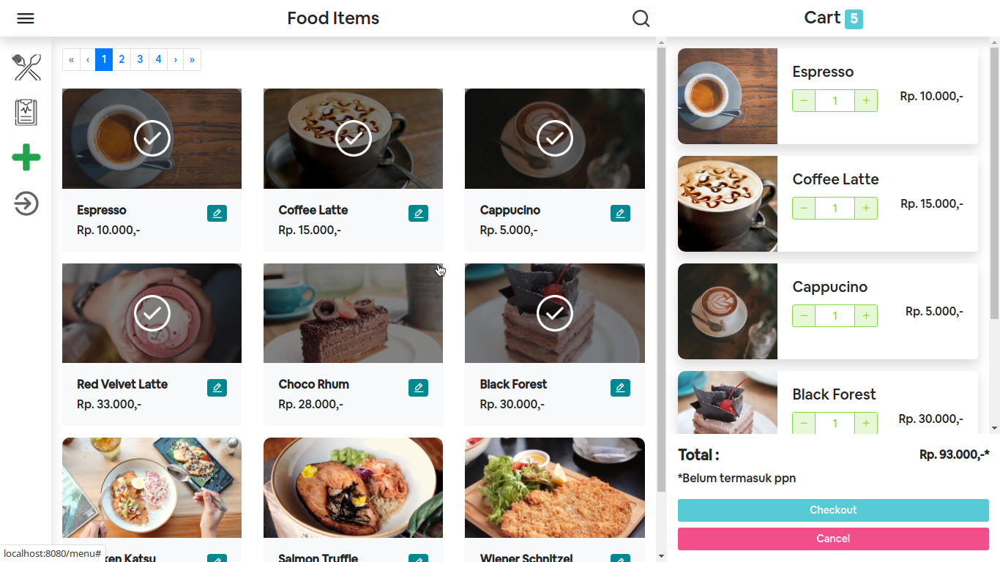

# POS App (Frontend)

## What is it?
This is a project (Point Of Sale) for restaurant. It was build by VUE, Bootstrap and etc.

Improved with centralized state management (VUEX)

---
## How to use?
1. Clone this repository
2. Clone backend repository (branch intermediate)
3. Run `npm install` on frontend and backend app
4. import the existing database in this repository (folder database)
5. Run backend server `npm run start-dev` / `npm run start-cli`
6. Run frontend server : 
   - for development use : `npm run serve`
   - for production use : 
        - install serve : `npm i -g serve`
        - run `npm run build`, wait till complete
        - run `serve -s dist`
---

## How the interface?
Demo On : http://54.84.168.198:8081/

  
  
Mobile Interface

  
    
Tablet Interface

  
  
Desktop Interface

---

## Where The API?
[It's the repository for API and the documentation](https://github.com/RZID/Week4-beginBackEnd/tree/intermediate)
